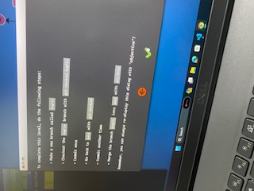

# GIT FUNDAMENTALS
- kernal => intermediate between hardware and shell (Command line).

- git was introduced to manage linux.

- git was introduced to make changes when coders were offline also

- git is a version control system. (branches and commits make it easy to control different versions in a project).

- each commit or a group of commits can be treated as a version.

> git init => creates a .git hidden folder in the folder you are writing your code to track all the changes made in the folder 

> git add => to add files in git , to add to staging.S

> git add . => adds all files to stage

Eg: git add hello.js => add hello.js files in git

> git commit -m "Starting my git fundamentals" => to commit changes giving a message.

> git status => to track the status 

- stage - a file, generally contained in your Git directory, that stores information about what will go into your next commit.

> git log => to check the details of commit.

- very commit has a hash value => this can be used to go to that particular commit 
> git checkout hashValueOfCommit => to go to a particular commit

> git checkout - => to go back to the previous commit after switching 

> git checkout master => to go to current commit.

> git log -1=> shows the latest commit

> git log -2=> shows the latest two commits

> git log --author=akshita => highlites the author

> git log -p => shows the patch (Code added and deleted)

> git log -p -1 => shows the patch of latest commit

> git log --help 

- -S -> pick-axe - Search => search to check where the bug is introduced.
> git log -S<word> => to search for some word in a commit type S and the word you want to search without spaces.

> git log -S<word> -p => to search for the word in the code in a commit. 
   - /<word> - highlight search 
   - <space> - page down
   - n - next match
   - N - prev match
 
### When to commit :
  1. Logical Change 
  2. Commits must be small
  3. Try to commit as frequently as possible
  4. Always commit when code is working
  5. Message should explain the why part rather than what

> to unstage the changes => git reset

> to delete changes => git checkout - .

> to reverse a commit => git revert commitID  
> to get out of vim :wq and enter

> git reset --soft HEAD~1 => the commit will be deleted but stored in the staging area. HEAD~1 will delete the first commit => can be used when we want to make changes.

> git reset --hard HEAD~1 => if you want to delete even from staging area.

- git works using linked lists.
- when we commit the previous commit file and the changes made are together saved as a new commit. 
.png>)

> git branch brachName => to create a branch

- to merge two branches 
   1. create branch => git branch branchName
   2. go to that branch => git checkout branchName
   3. commit that => git commit 
   4. merge => git merge branchName 

  
.png>)

- ### Branching Strategy
  1. master -> for customer 
  2. Staging -> QA (for testers)
  3. dev -> Developer 
  4. feat -> independent branch by each developer

- feat is merged with dev, after 2 weeks the dev will be merged to staging for testing . Afte 2 weeks the staging will be pushed to master .

- Fast forward merge => if the branch to which we are commiting doesn't have any other commits .

> git branch --all => to get all branches 

- if the branch is behind the master branch then merge commit takes place, if it is ahead then it is fast forward merge.

.png>) 

## SEMANTIC VERSIONING

v18.0.1 => 18 -> major version  ( major changes break the API)
           0  -> minor version  ( minor changes does not break API)
           1  -> Patches    (Bug Fixes)

> git push --set-upstream origin branchName => to push/publish the branch

- origin => online staging 

> git push => to push the code online to github (sync changes).

- we are pushing to github so that reviewers can view and check the code quality.

> git pull => changes made online will reflect offline.

- pull request => so that after we push the code to github , the reviewer can view the code and accept the request.

## How to do pull request (to merge online)
  1. push your code to github
  2. create pull request in github so that reviewer can view the code and approve the request and merge the code to master branch.
  3. if the reviewer asks some changes , the developer makes the changes and again push the code.
  4. after accepting the request pull the code to master branch.
  5. DevOps make the merge to master branch 
  6. we merge to dev, testers merge to staging , and devOps merge to master.

- hotfix - fix that needs immediate attention and pushed to master(Eg: bug raised by the customer).

#### Merge Conflict : if two people try to edit the same line from two branches.

-1.png>)

- this will create merge conflict 
- both feat-1 and feat-2 branches makes the same change in same file and same line of code and both merge to master
- this will create confilct 

### GIT STASH
> git stash => to store the code in the stack.Code is not pushed to online only stored . => used when the code is imcomplete and we cannot commit and we have a hotfix.

> git stash apply => to restore the code from stack

> to delete the stash => git stash drop

> to give stash a name => git stash save name

> if we are stashing more than one file to retore them use => git stash apply stashName

### GIT REBASE (Interactive)
- combine commits together 
- only do rebase on feature branch  as it will alter the history if we make changes in staging or dev or master branch
- Merge commits cannot be squashed
- when we reword the commit the commit ID will change
> git rebase -i HEAD~4 => to make changes on 3 commits select 4

.png>)
- edit means we can make change in the commit.
- reword , we can change the message of commit.
- change the pick to s to squash (do not squash the first commit as there will be no commit to squash in) 

### GIT REBASE
-1.png>)
.png>)

- We are doing this to avoid merge commit(happens when main is ahead that is there are some extra commits that in main that are not there in bugfix).

- to avoid merge commit we move the extra commits from main to bugfix branch  -> git rebase main (perform this in bugfix branch)

- now if we merge it will be a fastforward merge as bugFix is ahead of main

- we are avoiding merge commit because if will be easy to search the bug if the history is in a line. (we can search the bug using binary search , binary search is we find the mid and search if the bug is in first half or second half ).=> git bisect.

> git pull --rebase origin dev => run this command first daily to pull the changes from dev to feature.

### TERMINOLOGY USED PROFESSIONALLY

1. Configuration Management => Audit (we need checks and balances of what we are doing)-> by doing frequent commits.
   - Audit
      - git blame fileName =>  Show what revision and author last modified each line of a file , so that we can know who did what in a code.
     - git diff
   - git baseline => savepoints , code is secure from this point if we have any issue we go back to that point.
      - Tags - versions (v10.9.1)
      - commits
   - Accountability - who to hold responsible when something goes wrong
     - git blame
     - git log
   - Change Management - the process when we want to add more code(create branch, pull request...)
     - using branches
     - creating pull requests

2. System => Code is called as system (the product we are developing
)
3. Configuration Item(CI) => files in git.

4. Release Management => Branching Strategies -> master branch for customer, staging for testing , dev for developers. CI/CD (continous integration and continous deployment) -> deploy master to netlify.

#### Benefits
1. Tracebility - Who? Why?
2. Code Consistency & Quality (the code quality should be consistency)
3. Reduces the risk & avoids errors(Back up)
4. Change management is smooth

#### Release Management => Pass service
1. Planning ( proper plan when the relase should happen) => to implement the plan (Branching Strategy)

2. Governance => access level for each branch  

3. Scheduling => proper schedule to manage release, through sprints

4. Automation => CI/CD (To reduce human errors)

5. Contigency => backups , rollback to older version
.png>) 

- We ugligy the code to reduce the time of download in browser